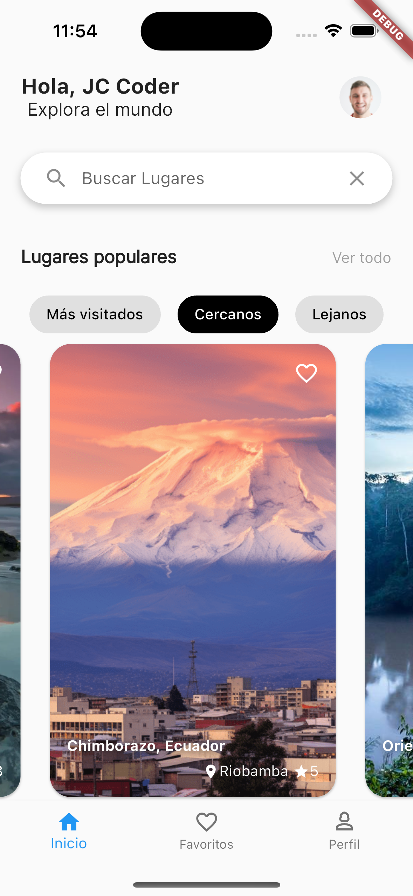
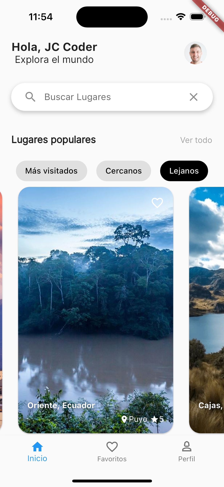
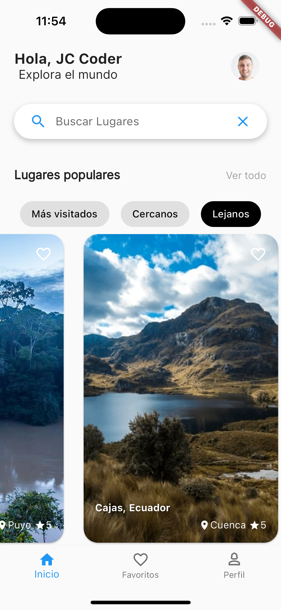

# flutter_travel

Esta aplicación es una representación de la interfaz de usuario (UI) para una aplicación dedicada a viajes. A continuación, se muestra una vista previa de cómo se ve la UI:

<table>
  <tr>
    <td>
      
    </td>
     <td>
      
    </td>
     <td>
      
    </td>
     <td>
      
    </td>
     <td>
      
    </td>
  </tr>
</table>